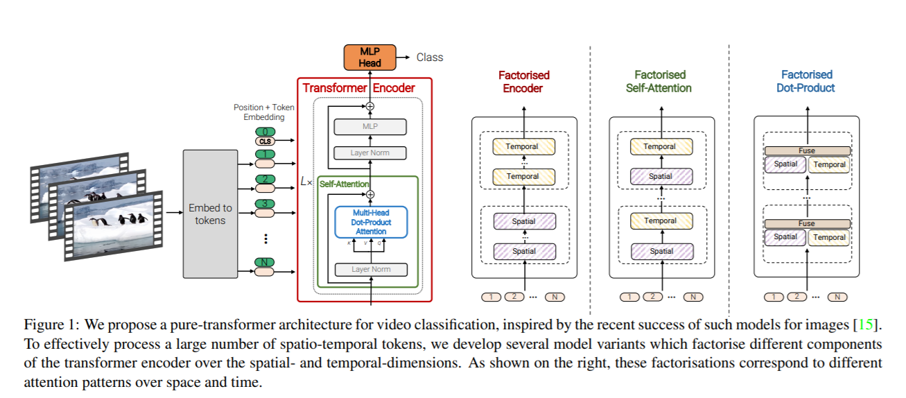

# ViViT: A Video Vision Transformer
Unofficial implementation of [ViViT: A Video Vision Transformer](https://arxiv.org/abs/2103.15691).


## Notes:
* This is in WIP.
* Model 2 is implemented, Model 3 and Model 4 isn't.

## Usage:
```
img = torch.ones([1, 16, 3, 224, 224])

model = ViViT(224, 16, 100, 16)
parameters = filter(lambda p: p.requires_grad, model.parameters())
parameters = sum([np.prod(p.size()) for p in parameters]) / 1_000_000
print('Trainable Parameters: %.3fM' % parameters)

out = model(img)

print("Shape of out :", out.shape)      # [B, num_classes]
```

## Citation:
```
@misc{arnab2021vivit,
      title={ViViT: A Video Vision Transformer}, 
      author={Anurag Arnab and Mostafa Dehghani and Georg Heigold and Chen Sun and Mario Lučić and Cordelia Schmid},
      year={2021},
      eprint={2103.15691},
      archivePrefix={arXiv},
      primaryClass={cs.CV}
}
```

## Acknowledgement:
* Base ViT code is borrowed from [@lucidrains](https://github.com/lucidrains) repo : https://github.com/lucidrains/vit-pytorch
* Some logic for Model 2 ViViT is from : https://github.com/lucidrains/STAM-pytorch 


